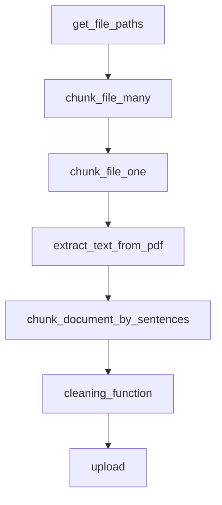
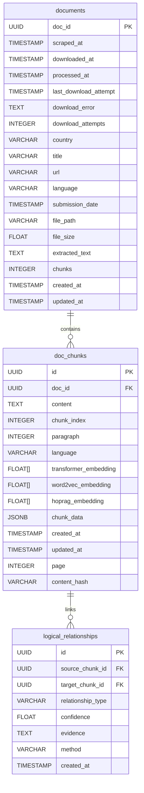

# Document Chunking Module Documentation

## Table of Contents

- [Overview](#overview)
- [System Architecture](#system-architecture)
- [Core Functions](#core-functions)
  - [Entry Point: run_script()](#entry-point-run_script)
  - [Individual Processing: chunk_file_one()](#individual-processing-chunk_file_one)
  - [Concurrent Processing: chunk_file_many()](#concurrent-processing-chunk_file_many)
  - [File Discovery: get_file_paths()](#file-discovery-get_file_paths)
- [Processing Pipeline](#processing-pipeline)
  - [Text Extraction](#text-extraction)
  - [Document Chunking](#document-chunking)
  - [Content Cleaning](#content-cleaning)
  - [Database Storage](#database-storage)
- [Chunk Metadata Schema](#chunk-metadata-schema)
- [Error Handling & Resilience](#error-handling--resilience)
- [Database Schema](#database-schema)
- [Performance Considerations](#performance-considerations)
- [Usage Examples](#usage-examples)
- [Configuration](#configuration)

---

## Overview

The `2_chunk.py` module is a core component of the RAG (Retrieval-Augmented Generation) pipeline responsible for transforming raw PDF documents into structured, semantically coherent text chunks. This module processes NDC (Nationally Determined Contributions) documents and prepares them for vector embedding.

**Key Responsibilities:**
- Extract text from PDF documents using multiple fallback strategies
- Segment documents into semantically meaningful chunks
- Clean and standardize text content
- Store processed chunks in PostgreSQL database
- Handle document metadata and processing state

**Entry Point:**
```bash
python 2_chunk.py [--force]
```

**System Flow:**
```text
PDF Files (data/pdfs/)
    ↓
extract_text_from_pdf() [multiple strategies]
    ↓
DocChunker.chunk_document_by_sentences()
    ↓
DocChunker.cleaning_function()
    ↓
Database Storage (doc_chunks table)
```

---

## System Architecture

The module follows a pipeline architecture with clear separation of concerns:

```text
┌─────────────────┐    ┌─────────────────┐    ┌─────────────────┐
│  File Discovery │ -> │  Text Extraction│ -> │   Chunking      │
│  get_file_paths │    │  extractor.py   │    │  chunker.py     │
└─────────────────┘    └─────────────────┘    └─────────────────┘
                                                      │
┌─────────────────┐    ┌─────────────────┐    ┌─────────────────┐
│ Database Storage│ <- │  Text Cleaning  │ <- │  Validation     │
│  operations.py  │    │   cleaner.py    │    │    & QA         │
└─────────────────┘    └─────────────────┘    └─────────────────┘
```

**Key Components:**
- **extractor.py**: Multi-strategy PDF text extraction
- **chunker.py**: Sentence-based document segmentation  
- **cleaner.py**: Text cleaning and quality control
- **operations.py**: Database interaction layer
- **models.py**: SQLAlchemy ORM definitions

---

## Core Functions



### Entry Point: run_script()

**Function Signature:**
```python
@Logger.log(log_file=project_root / "logs/chunk.log", log_level="INFO")
async def run_script(force_reprocess: bool = False) -> None
```

**Purpose:** Main orchestrator function that processes all PDF files in the data directory.

**Process Flow:**
1. Discovers all PDF files using `get_file_paths()`
2. Creates async tasks for parallel processing
3. Shows progress bar for user feedback
4. Handles errors gracefully and logs results

### Individual Processing: chunk_file_one()

**Function Signature:**
```python
async def chunk_file_one(file_path: str, force_reprocess: bool = False) -> Optional[List[DocChunkORM]]
```

**Purpose:** Process a single PDF file through the complete chunking pipeline.

**Detailed Process:**

1. **Document State Check:**
   ```python
   doc_id = Path(file_path).stem
   is_processed, document = check_document_processed(session, doc_id)
   ```

2. **Document Creation (if needed):**
   - Extracts metadata from filename (country, language, date)
   - Creates `NDCDocumentORM` record
   - Uses deterministic UUID5 for consistent document IDs

3. **Multi-Strategy Text Extraction:**
   ```python
   extraction_strategies = ['fast', 'auto', 'ocr_only']
   for strategy in extraction_strategies:
       extracted_elements = extract_text_from_pdf(file_path, strategy=strategy)
   ```

4. **Document Chunking:**
   ```python
   chunks = DocChunker.chunk_document_by_sentences(extracted_elements)
   ```

5. **Content Cleaning:**
   ```python
   cleaned_chunks = DocChunker.cleaning_function(chunks)
   ```

6. **Database Storage:**
   - Creates `DocChunkORM` objects (without embeddings)
   - Uploads chunks to database
   - Updates document processing status

### Concurrent Processing: chunk_file_many()

**Function Signature:**
```python
async def chunk_file_many(file_path: str) -> Optional[List[DocChunkORM]]
```

**Purpose:** Wrapper function that adds concurrency control to individual file processing.

**Implementation:**
```python
semaphore = asyncio.Semaphore(FILE_PROCESSING_CONCURRENCY)
async with semaphore:
    return await chunk_file_one(file_path)
```

### File Discovery: get_file_paths()

**Function Signature:**
```python
def get_file_paths() -> List[str]
```

**Purpose:** Discovers all PDF files in the designated data directory.

**Process:**
1. Scans `data/pdfs/` directory
2. Filters for PDF files only
3. Converts Path objects to strings
4. Logs discovery results

---

## Processing Pipeline


### Text Extraction

The text extraction component (`extractor.py`) implements a robust multi-strategy approach:

**Strategy Hierarchy:**
1. **Fast**: Standard PDF text extraction without OCR
2. **Auto**: Automatic best-method detection
3. **OCR Only**: Optical Character Recognition for image-based PDFs

**Example Output:**
```python
{
    'text': "Climate change adaptation strategies...",
    'metadata': {
        'page_number': 1,
        'paragraph_number': 3,
        'country': 'Argentina',
        'element_type': 'Text',
        'extraction_strategy': 'fast'
    }
}
```

### Document Chunking

The chunking component (`chunker.py`) implements sentence-based segmentation:

**Configuration:**
- **Max Chunk Size**: 512 characters (configurable)
- **Overlap**: 2 sentences between chunks (configurable)
- **Special Handling**: Titles and headers as standalone chunks

**Algorithm:**
```python
def chunk_document_by_sentences(elements: list, max_chunk_size: int = 512, overlap: int = 2):
    # 1. Process each document element
    # 2. Handle titles/headers separately
    # 3. Split regular text into sentences
    # 4. Accumulate sentences until size threshold
    # 5. Create overlapping chunks for context preservation
```

**Metadata Preservation:**
- Page numbers
- Paragraph numbers
- Element types
- Document-level metadata (country, title, date)

### Content Cleaning

The cleaning component (`cleaner.py`) provides multi-stage text processing:

**Cleaning Strategies:**
1. **merge_short_chunks()**: Combines chunks below minimum length threshold
2. **split_long_chunks()**: Divides chunks exceeding maximum length
3. **remove_gibberish()**: Removes OCR artifacts and corrupted text

**Quality Filters:**
- Character corruption detection
- Common PDF artifact removal
- Minimum content length enforcement
- Excessive punctuation normalization

### Database Storage

The storage component uses SQLAlchemy ORM with PostgreSQL:

**Data Models:**
- **NDCDocumentORM**: Document metadata and processing state
- **DocChunkORM**: Individual text chunks with embeddings (filled later)
- **LogicalRelationshipORM**: Inter-chunk relationships

**Storage Process:**
1. Create document record if not exists
2. Generate UUID4 for each chunk
3. Store chunk content and metadata in `chunk_data` JSONB field
4. Update document processing timestamp
5. Handle transaction rollback on errors

**Metadata Enrichment:**
During storage, chunks are enriched with document-level metadata:
- Document URL and dates are retrieved from the `documents` table
- Metadata from extraction and chunking stages is preserved
- All metadata is stored in the `chunk_data` JSONB column

---

## Chunk Metadata Schema

The `chunk_data` field in the `doc_chunks` table stores additional metadata about each chunk in JSON format. This metadata includes information about the chunk's position in the document, extraction details, document-level information, and processing timestamps.

### Schema Structure

```json
{
  // Document Position & Structure
  "page_number": 1,
  "paragraph_number": 1,
  "paragraph_numbers": [1, 2],
  "paragraph_ids": ["para_123", "para_124"],
  "global_paragraph_number": 5,
  "global_paragraph_numbers": [5, 6],
  "paragraph_id": "para_123",
  "chunk_index": 0,
  
  // Document Information
  "url": "https://unfccc.int/...",
  "document_url": "https://unfccc.int/...",
  "filename": "Rwanda_en_20220601.pdf",
  "document_title": "Rwanda NDC",
  "country": "Rwanda",
  "language": "en",
  
  // Document Dates (ISO format strings)
  "submission_date": "2022-06-01",
  "scraped_at": "2025-11-17T23:47:07.463000+00:00",
  "downloaded_at": "2025-11-17T23:48:15.123000+00:00",
  "processed_at": "2025-11-17T23:50:30.456000+00:00",
  
  // Extraction Metadata
  "extraction_method": "fast",
  "extraction_status": "success",
  "element_types": ["Text", "Paragraph"],
  "extraction_strategy": "auto",
  
  // Content Metadata
  "sentences": ["Sentence 1.", "Sentence 2."],
  "sentence_count": 2,
  "character_count": 256
}
```

### Field Descriptions

#### Document Position & Structure

| Field | Type | Description | Example |
|-------|------|-------------|---------|
| `page_number` | `integer` | Page number in the source document (0-indexed or 1-indexed depending on extractor) | `5` |
| `paragraph_number` | `integer` | Paragraph number within the page (may be present from extractor) | `3` |
| `paragraph_numbers` | `array<integer>` | List of paragraph numbers if chunk spans multiple paragraphs | `[3, 4]` |
| `paragraph_id` | `string` | Unique identifier for the paragraph (may be present from extractor) | `"para_123"` |
| `paragraph_ids` | `array<string>` | List of paragraph IDs if chunk spans multiple paragraphs | `["para_123", "para_124"]` |
| `global_paragraph_number` | `integer` | Paragraph number across entire document (may be present from extractor) | `42` |
| `global_paragraph_numbers` | `array<integer>` | List of global paragraph numbers if chunk spans multiple paragraphs | `[42, 43]` |
| `chunk_index` | `integer` | Position of chunk within document (0-indexed, added during database insertion) | `15` |

#### Document Information

| Field | Type | Description | Example |
|-------|------|-------------|---------|
| `url` | `string` | Source URL of the document (added from `documents` table) | `"https://unfccc.int/NDCREG/Pages/..."` |
| `document_url` | `string` | Alias for `url` (for compatibility, added during database insertion) | Same as `url` |
| `filename` | `string` | Local filename of the PDF (from extractor metadata) | `"Rwanda_en_20220601.pdf"` |
| `document_title` | `string` | Title of the document (from extractor metadata) | `"Rwanda NDC"` |
| `country` | `string` | Country name (from extractor metadata or filename) | `"Rwanda"` |
| `language` | `string` | Document language code (from extractor metadata or filename) | `"en"`, `"fr"`, `"es"` |

#### Document Dates

All date fields are stored as ISO 8601 format strings (e.g., `"2025-11-17T23:47:07.463000+00:00"`). These are added from the `documents` table during database insertion.

| Field | Type | Description | Example |
|-------|------|-------------|---------|
| `submission_date` | `string` | Date when the document was submitted to UNFCCC (ISO date format) | `"2022-06-01"` |
| `scraped_at` | `string` | Timestamp when document was scraped from website (ISO datetime) | `"2025-11-17T23:47:07+00:00"` |
| `downloaded_at` | `string` | Timestamp when document PDF was downloaded (ISO datetime) | `"2025-11-17T23:48:15+00:00"` |
| `processed_at` | `string` | Timestamp when document was processed/chunked (ISO datetime) | `"2025-11-17T23:50:30+00:00"` |

**Note:** The chunk record itself has a `created_at` timestamp in the `doc_chunks` table, which is separate from these document-level dates.

#### Extraction Metadata

| Field | Type | Description | Example |
|-------|------|-------------|---------|
| `extraction_method` | `string` | Method used to extract text (`"fast"`, `"auto"`, `"ocr_only"`) | `"fast"` |
| `extraction_strategy` | `string` | Strategy that successfully extracted the text | `"auto"` |
| `extraction_status` | `string` | Status of extraction (`"success"`, `"failed"`, `"fallback"`) | `"success"` |
| `element_types` | `array<string>` | Types of elements in this chunk (`"Text"`, `"Title"`, `"Heading"`, etc.) | `["Text", "Paragraph"]` |

#### Content Metadata

| Field | Type | Description | Example |
|-------|------|-------------|---------|
| `sentences` | `array<string>` | List of sentences in the chunk (added during chunking) | `["First sentence.", "Second sentence."]` |
| `sentence_count` | `integer` | Number of sentences in chunk (may be calculated from `sentences` array) | `2` |
| `character_count` | `integer` | Approximate character count (may be calculated from content) | `256` |

### Field Availability

Not all fields are present in every chunk. Field availability depends on:

1. **Extraction method**: Different PDF extraction strategies may provide different metadata
2. **Document structure**: Some documents may not have page numbers, paragraphs, etc.
3. **Processing stage**: Fields are added at different stages:
   - **During extraction**: `page_number`, `paragraph_number`, `paragraph_id`, `global_paragraph_number`, `element_types`, `filename`, `country`, `document_title`, `submission_date`
   - **During chunking**: `paragraph_numbers` (array), `paragraph_ids` (array), `global_paragraph_numbers` (array), `sentences` (array), `element_types` (array)
   - **During database insertion**: `url`, `document_url`, `chunk_index`, `submission_date`, `scraped_at`, `downloaded_at`, `processed_at`

### Usage Examples

#### Querying Chunks by Metadata

```sql
-- Find chunks from documents submitted in 2022
SELECT * FROM doc_chunks 
WHERE chunk_data->>'submission_date' LIKE '2022%';

-- Find chunks from a specific country
SELECT * FROM doc_chunks 
WHERE chunk_data->>'country' = 'Rwanda';

-- Find chunks from a specific page
SELECT * FROM doc_chunks 
WHERE (chunk_data->>'page_number')::int = 5;

-- Find chunks with URLs
SELECT * FROM doc_chunks 
WHERE chunk_data->>'url' IS NOT NULL 
  AND chunk_data->>'url' != '';
```

#### Accessing Metadata in Python

```python
import json
from databases.models import DocChunkORM

# Get chunk with metadata
chunk = session.query(DocChunkORM).first()

# Access metadata
metadata = chunk.chunk_data or {}
url = metadata.get('url')
submission_date = metadata.get('submission_date')
page_number = metadata.get('page_number', 0)
```

#### Filtering by Date Range

```sql
-- Find chunks from documents submitted between dates
SELECT * FROM doc_chunks 
WHERE chunk_data->>'submission_date' >= '2022-01-01'
  AND chunk_data->>'submission_date' < '2023-01-01';
```

### Field Priority

When the same information exists in multiple places:

1. **Chunk metadata (`chunk_data`)** - Most detailed, includes document-level info
2. **Chunk table columns** - `page`, `paragraph`, `language` (normalized fields)
3. **Document table** - Join via `doc_id` for `url`, `submission_date`, etc.

**Best Practice**: Use `chunk_data` for document-level metadata (URL, dates, country) and table columns for position metadata (page, paragraph) when available.

### Metadata Flow

The metadata flows through the pipeline as follows:

1. **Extraction Stage** (`extractor.py`):
   - Adds: `page_number`, `paragraph_number`, `paragraph_id`, `global_paragraph_number`, `element_type`, `filename`, `country`, `document_title`, `submission_date`, `extraction_method`, `extraction_strategy`, `extraction_status`

2. **Chunking Stage** (`chunker.py`):
   - Preserves extraction metadata
   - Adds: `paragraph_numbers` (array), `paragraph_ids` (array), `global_paragraph_numbers` (array), `element_types` (array), `sentences` (array)

3. **Database Insertion Stage** (`2_chunk.py`):
   - Retrieves document metadata from `documents` table
   - Adds: `url`, `document_url`, `chunk_index`, `scraped_at`, `downloaded_at`, `processed_at`
   - Merges all metadata into `chunk_data` JSONB field

### Version History

- **2025-11-17**: Added `url`, `document_url`, `submission_date`, `scraped_at`, `downloaded_at`, `processed_at` fields to chunk metadata during chunking process
- **Initial**: Basic position and extraction metadata fields

### Related Documentation

- [Database Schema](./db_schema.md) - Overall database structure
- [Chunking Documentation](./2_chunk.md) - How chunks are created (this document)
- [Scraping Documentation](./1_scrape.md) - How documents are scraped and metadata is collected

---

## Error Handling & Resilience

The module implements comprehensive error handling:

**Extraction Fallbacks:**
```python
# Multi-strategy extraction with fallbacks
for strategy in ['fast', 'auto', 'ocr_only']:
    try:
        extracted_elements = extract_text_from_pdf(file_path, strategy=strategy)
        if extracted_elements and len(extracted_elements) > 0:
            break
    except Exception as e:
        logger.warning(f"Strategy {strategy} failed: {e}")
```

**Database Transaction Safety:**
```python
try:
    session.add(chunk_model)
    session.commit()
except Exception as e:
    session.rollback()
    logger.error(f"Database error: {e}")
finally:
    session.close()
```

**Graceful Degradation:**
- Fallback content creation when extraction fails
- Continued processing when individual files fail
- Progress tracking even with errors

---

## Database Schema



**Key Relationships:**
- Documents contain multiple chunks (CASCADE DELETE)
- Chunks may have multiple outgoing and incoming logical relationships with other chunks
- Embeddings are a prerequisite for constructing logical relationships. The embedding step must occur before the HopRAG graph is built.

---

## Performance Considerations

**Concurrency Control:**
- Configurable processing concurrency via `FILE_PROCESSING_CONCURRENCY`
- Async/await pattern for non-blocking I/O operations
- Semaphore-based resource management

**Memory Management:**
- Streaming text processing to avoid loading entire documents
- Immediate database commits to free memory
- Connection pooling via SQLAlchemy

**Processing Optimization:**
- Early termination of extraction strategies on success
- Chunk validation before database operations
- Efficient metadata copying and merging

---

## Usage Examples

### Basic Processing
```bash
# Process all PDF files
python 2_chunk.py

# Force reprocess all files (for debugging)
python 2_chunk.py --force
```

### Programmatic Usage
```python
import asyncio
from entrypoints.chunk import run_script

# Process all files
asyncio.run(run_script(force_reprocess=False))

# Process single file
from entrypoints.chunk import chunk_file_one
chunks = await chunk_file_one("path/to/document.pdf")
```

### Custom Configuration
```python
# Configure chunk sizes
chunks = DocChunker.chunk_document_by_sentences(
    elements=extracted_elements,
    max_chunk_size=1024,  # Larger chunks
    overlap=3             # More overlap for context
)
```

---

## Configuration

**Environment Variables:**
- `FILE_PROCESSING_CONCURRENCY`: Maximum concurrent file processing

**File Paths:**
- Input: `data/pdfs/`
- Logs: `logs/chunk.log`
- Processed data: Database storage

**Key Parameters:**
- Default chunk size: 512 characters
- Default overlap: 2 sentences
- Minimum chunk length: 20 characters
- Maximum chunk length: 1000 characters

**Database Connection:**
- Uses `PostgresConnection()` from `databases.auth`
- Automatic session management and cleanup
- Transaction safety with rollback support

---

## Dependencies

**Core Libraries:**
- `unstructured`: PDF text extraction
- `nltk`: Sentence tokenization
- `sqlalchemy`: Database ORM
- `asyncio`: Asynchronous processing
- `tqdm`: Progress tracking

**Internal Modules:**
- `group4py.src.chunk.extractor`
- `group4py.src.chunk.chunker`  
- `group4py.src.chunk.cleaner`
- `databases.models`
- `databases.operations`
- `databases.auth`

The module is designed for reliability, scalability, and maintainability, serving as a critical foundation for the downstream embedding and retrieval components of the RAG pipeline. 